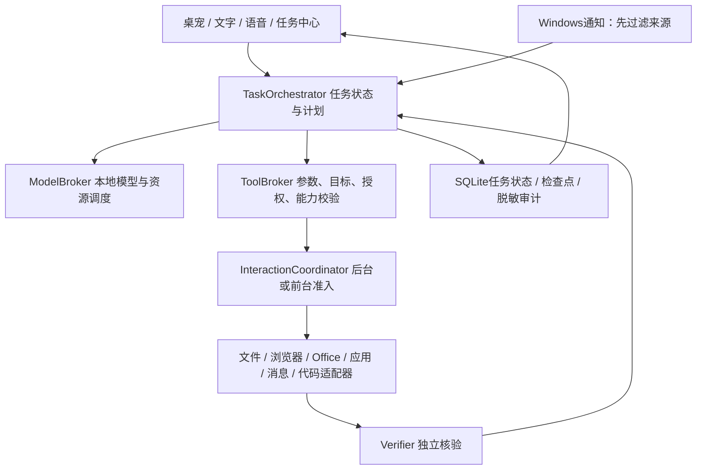

# 小K后续开发完整计划

版本：规划 v1，状态更新至2026-10-09（当前签名安装版0.1.83.0）。范围：这台 Windows 电脑上的长期本地助手。

## 最新模型筛查与闸门状态（2026-10-09）

本机新一轮固定评测下，Qwen3.5-9B为R类5/10、S类4/8，最多31/40；MiMo 9B为R类8/10、S类1/8，最多31/40；JEV-9B Q4_K_M文本GGUF为R类7/10、S类5/10、M01未通过，合计12/21，最多31/40。均低于32/40发布线，不切换生产模型；JEV这份GGUF不包含或验证专用System 1决策头。微信/QQ自然通知来源及私聊归属仍未核验，通知监控与正文读取保持关闭。接下来只推进不依赖模型准入和真实通知的任务；通知闸门需等来源可确认的自然通知，编码代理运行则需先有通过完整门槛的本机模型。逐题证据见[编码任务初筛记录](../验收与评测/MiMo与Qwen编码任务初筛记录.md)。

最近的整体模型与通知闸门同步提交`dc8a29f`已推送至`origin/main`；GitHub Actions [Build #390](https://github.com/mingkailin70-cmd/desktop-assistant/actions/runs/37904240938)成功。2026-10-09另完成已安装版0.1.83.0文件内容搜索只读诊断：仓库验证包与安装副本的适配器/Core逐字节一致，合成UTF-8/UTF-16路径和行号检查通过，匹配正文未泄露；真实目录性能、并发编辑与普通界面交互仍待验收。其他阶段实现与未验收边界见下方R3记录和[开发进度与待办](开发进度与待办.md)。

R0通知接口补充（2026-10-09）：微软标准通知监听对象提供应用身份及Toast可见内容，但没有结构化会话ID、联系人稳定ID或私聊标记。安装版0.1.81.0设置页的一次性只读诊断已运行：Windows通知访问权限为允许；当前最多512条Toast快照给出候选 QQ | QQ，共4条；未发现微信候选。诊断只读应用显示名与AUMID，没有读取正文、保存结果、写入白名单或启用持续监听；设置页已取消，Host已退出。该候选尚未与用户可识别的真实QQ通知对应，不能证明账号稳定身份或私聊属性。仍需在自然到达、来源可确认的通知上逐步核对，再完成每款至少30条样本门槛。详见[Windows通知接入与隐私边界](../架构与接口/Windows通知接入与隐私边界.md)。

本文是持续实施路线，不是功能完成声明。用户已将本计划设为项目目标。R0通知只读诊断有QQ来源候选但尚未对应到真实来源，未发现微信候选；来源与私聊身份仍未核实，正文分析和持续监听保持关闭。编码候选仍未达到统一40题质量线：Qwen3.5-4B各独立管线R/S/M/F子集为7/10、0/10、0/10、2/10，不能合并为总分；Qwen3.5-9B、MiMo和JEV也仅有失败或不完整的候选筛查。当前账户签名MSIX 0.1.83.0已安装，状态Ok；包139,305,762字节，SHA-256 `1C5725AC58712E1D0117F6C1456CBDD5AFB59798EFE63E9FDEC648893745A554`，签名有效。Release构建0警告/0错误、安全套件119项（0跳过）、桌面体验76项通过。文本/DOCX/PDF摘要切片已进入安装版；PDF采用512 MiB/20秒受限子进程并通过安装版合成文本提取。模型质量、推理时延、普通界面和真实用户文件任务未验收。当前未启动模型；微信/QQ监听开关仍关闭，没有读取Toast正文或发送消息。R1任务中心/取消恢复、R2桌宠真实合成/DPI/语音设备、R3工具实际输入输出、R4消息闭环、R5编码门槛、R6登录/重启/长期运行与回滚仍待完成；P0/P4发布门槛继续保留。

R3本阶段（2026-10-09，0.1.83.0）：本机文档摘要新增PDF可选择文字提取，锁定PdfPig 0.1.16；PDF最多8 MiB、100页及64 KiB提取文字。解析放入低优先级子进程，由Windows Job Object限制512 MiB进程内存和20秒时限，内容经管道传入、不落盘；无法施加限制时拒绝解析，取消或超时终止子进程。合成夹具覆盖跨页文字、扫描件空文本、文件/页数/文字上限及损坏PDF。固定SDK Release构建0警告/0错误，安全套件119项（0跳过）和桌面专项76项通过。签名MSIX 139,305,762字节，SHA-256 `1C5725AC58712E1D0117F6C1456CBDD5AFB59798EFE63E9FDEC648893745A554`，当前账户已安装且状态`Ok`；隐藏启动/正常退出、安装版合成PDF提取和前台HWND不变通过。未启动模型或读取真实文档；模型摘要质量、推理时延、复杂PDF峰值资源及普通用户任务仍待验收。
R3本阶段（2026-10-09，0.1.80.0）：加入固定后台文本文件摘要工具，只读取配置搜索根内单个普通文本/源码文件，限制64 KiB，并用本机模型分段摘要。正文作为不可信数据传递，正文与路径不进入SQLite历史或摘要日志。固定SDK Release构建0警告/0错误；Windows安全套件119项、桌面体验专项76项通过。签名MSIX 137,424,861字节，SHA-256 `F1E74A5ECB191BD102CB5D21BABD63C6F9C1316645EF0835436D56C41D0C84EF`，已安装且状态`Ok`；隔离后台启动/正常退出通过，前台HWND不变。因可用显存约5,578 MiB、低于6,024 MiB门槛，本次未启动模型；摘要质量、时延和普通用户任务仍待验收。

R1本阶段（2026-10-09，0.1.79.0）：任务中心待办页签现显示审批、代码审阅和消息预览数量；空列表不显示数字，非空数量随3秒刷新同步更新，不弹窗、不切换页签或抢焦点。核心显示策略覆盖0、负数、1和队列上限16。固定SDK Release构建0警告/0错误；Windows安全套件118项、桌面体验专项76项通过。签名MSIX 137,418,864字节，SHA-256 `86B2C6D7B1B01A3964C6F185434C27BC08D99C6ADFECA366EF78BC58D06E8201`，已安装且状态`Ok`；隔离后台启动与正常退出通过，前台HWND不变。普通界面待办数字的可见渲染及真实待办处理仍待用户会话验收。实现提交`19f7089`已推送至`origin/main`；GitHub Actions [Build #37878718735](https://github.com/mingkailin70-cmd/desktop-assistant/actions/runs/37878718735)通过。
R1本阶段（2026-10-09，0.1.78.0）：修复隔离编程任务`verifying`状态在任务中心显示为未知、并误给出结果待核对指引的问题；状态文案和下一步策略现由Core共享，分别显示“核验中”和等待独立核验。Release构建0警告、0错误；Windows安全套件118项、桌面专项76项通过。签名MSIX 137,418,612字节，SHA-256 `C8500C137EC439099A83B07C220057E58358CE47EF332BC050CA70AC0ECA2103`，已安装且状态`Ok`；隔离后台启动/正常退出通过，普通任务中心视觉与真实任务流程仍待验收。阶段提交`55f8991`已推送至`origin/main`；GitHub Actions [Build #37876853658](https://github.com/mingkailin70-cmd/desktop-assistant/actions/runs/37876853658)通过。
R1回归补强（2026-10-09）：新增隔离编程任务真实状态写入/读回检查，以生产`CodeWorkspaceSnapshot`和历史读取路径验证HostSessionId在同会话与跨会话的恢复判断。该项只增补测试，不改变运行时或已安装包；固定SDK Release构建0警告/0错误，安全套件118项和桌面体验专项76项通过。阶段提交`a6a7b92`已推送至`origin/main`；GitHub Actions [Build #37875788202](https://github.com/mingkailin70-cmd/desktop-assistant/actions/runs/37875788202)通过。
R1本阶段（2026-10-09，0.1.76.0）：SQLite v5→v6新增HostSessionId，迁移前一致性备份并将旧会话未完成任务置为结果待核对；审批不会跨进程恢复，已完成、失败和取消终态保留。Release构建0警告、0错误；安全套件117项、桌面专项76项通过。签名MSIX已安装，隔离后台启动/正常退出通过；真实用户数据库v4→v6迁移已在实库验证通过，普通任务中心仍待验收。
R1本阶段（2026-10-09，真实用户数据库v4→v6迁移）：在Host未运行时使用与Host相同的`SqliteTaskStore`初始化入口完成真实数据库迁移。迁移前自动建立v4一致性备份，备份和迁移后数据库均`quick_check=ok`，任务行与原有终态保持不变，v6的`host_session_id`列存在。检查只覆盖架构、完整性与状态元数据，不读取任务正文；未启动普通Host界面。真实任务中心和睡眠/掉电恢复仍待验收。

R1本阶段（2026-10-09，0.1.75.0）：后台启动时不初始化VPet渲染器，只有桌宠主窗口可见后才按需初始化。用已安装MSIX以`--diagnostics-profile --background`启动，验证命令行参数、标题“小K”的主窗口不可见、前台HWND不变，并向准确主窗口投递正常退出消息；进程正常退出且无Host残留。隔离配置仅使用新建Temp目录，通知监听、唤醒词、应用和搜索根均关闭或为空；未读取通知或执行用户任务。Release构建0警告/0错误，安全套件116项、桌面专项76项通过；签名包已安装且验签0警告/0错误，证书信任未改。阶段提交`5e074ae`已推送；GitHub Actions [Build #37869386224](https://github.com/mingkailin70-cmd/desktop-assistant/actions/runs/37869386224)成功。此证据只覆盖隐藏启动与正常退出，不代表登录启动、普通界面、资源占用或长期运行验收。

R0编程代理近期纠正提示实验（v81–v82）只覆盖合成别名题S02：v81下Qwen和MiMo均未通过；v82因省略违规补丁上下文而使Qwen9B通过、MiMo仍失败。单题结果不能与旧管线拼分，也不改变候选模型准入；完整评测、消息验收与首版闸门保持未完成。详见[候选筛查记录](../验收与评测/MiMo与Qwen编码任务初筛记录.md)。

R3 本阶段（2026-10-09）：在单文件压缩之外增加固定后台目录压缩动作“压缩文件夹：完整路径”。只允许配置搜索根内普通目录，深度5层、5,000项、1,000文件、500 MiB总量和540 MiB ZIP上限；拒绝链接/特殊项/越界目录，逐项解压校验SHA-256后才固定导出并保留源目录。Release构建0警告/0错误，安全套件116项和桌面专项74项通过；签名MSIX 0.1.74.0已安装、状态Ok，安装器未启动小K，安装包内Windows适配器与Release发布副本散列一致。此项仍未用真实用户目录验收。

## 1. 最终产品目标

你继续使用电脑工作，小K理解你的具体任务，选择不干扰前台的方式完成操作，独立核验结果；遇到权限、目标或能力问题，准确反馈并等待必要信息。

产品由三部分构成：

1. 银渐层小猫桌宠：可调整尺寸、移动、隐藏，显示状态和入口。
2. 个人任务助手：语音/文字、任务中心、进度、取消、问题反馈、偏好。
3. 本地执行系统：应用、文件、网页、办公、消息、媒体、编程和一般系统操作。

支持范围按适配器扩展，不把五个应用白名单当成长期产品上限；没有可靠接口的操作明确标示限制。资金、钱包、银行、交易、密码、验证码、密钥等敏感操作不纳入概括授权。永久删除、权限变更、管理员修改仍需具体确认。

## 2. 当前基线与尚未完成的部分

2026-10-09最新安装、数据库与R0基线核对：当前账户已安装签名MSIX 0.1.83.0，状态`Ok`；包139,305,762字节，SHA-256 `1C5725AC58712E1D0117F6C1456CBDD5AFB59798EFE63E9FDEC648893745A554`，验签0警告、0错误，证书信任未改变。真实用户SQLite v4→v6迁移及迁移前备份、迁移后`quick_check=ok`已核验，任务行与终态保持不变。Release构建0警告/0错误，Windows安全套件119项、桌面专项76项通过；PDF摘要子进程安装版合成提取通过。固定编码集40题/40份评审答案与散列验证通过，未运行模型/夹具。当前显存可用5860 MiB，低于6024 MiB启动线，因此没有启动模型；早前5648 MiB是另一时点快照。未启动麦克风或通知监听。

| 项目 | 状态 | 规划含义 |
| --- | --- | --- |
| 已安装/源码版本 | 当前账户签名MSIX 0.1.83.0，状态Ok；包139,305,762字节，SHA-256 `1C5725AC58712E1D0117F6C1456CBDD5AFB59798EFE63E9FDEC648893745A554`；签名有效 | Release构建0警告/0错误，Windows安全套件119项和桌面专项76项通过；文本/DOCX/PDF摘要夹具通过；安装版PDF Worker合成提取、隐藏启动/正常退出和前台不变已核对 | 普通任务中心、登录启动、真实模型质量、真实用户任务、通知分析和长期运行仍未验收 |
| 桌宠 | v15静态三维渲染猫；源码已支持40%–160%缩放；正式Host接入VPet Core 1.1.0.66，通过四张小K自制姿态PNG响应待机/聆听/思考/执行状态；失败时回退静态猫 | 0.1.72.0包含VPet及网页切片；安装后未启动。姿态图仍为静态帧。DWM桌面合成、实际状态切换、缩放/DPI/睡眠恢复、CPU/RAM/显存仍待验收 |
| 缩放/后台准入 | 手动缩放源码已进入0.1.54.0；0.1.58.0固定后台入口；0.1.59.0副作用结果不确定保护；0.1.60.0通知来源诊断；0.1.63.0单文件回收站；0.1.64.0统一18类持久化；0.1.66.0按TaskId投影当前待办状态；0.1.67.0按稳定条目键保留任务中心刷新选择；0.1.68.0取消按钮保留`CanCancel`绑定；0.1.69.0托盘打开任务中心不再展开桌宠主面板；0.1.70.0退出时持久化尚未开始任务的取消状态；0.1.72.0静态与显式隔离动态网页只读；0.1.73.0动态渲染单步超时与浏览器退出限时 | 安全套件115项、桌面专项73项通过；普通窗口缩放、多屏/DPI、焦点与任务恢复仍需真实用户会话核验 |
| 任务中心 | 0.1.54.0含非模态状态列表、最多16项等待队列、逐任务取消、审批待办、生命周期步骤、目标范围、执行模式及下一步建议 | 已安装版可访问性树显示30条既有状态记录及新增字段；当前采集截图只包含Host主窗口，没有独立显示任务中心弹窗。真实队列、焦点与恢复验收仍未完成 |
| 编程代理 | v84 严格补丁 Schema、v85单题隔离夹具已检查；Qwen3.5-9B v80的S01–S10为2/10，R01失败后理论上限31/40；v82只在S02单题上通过，MiMo同题未通过 | 旧分项不拼分；所有候选仍未达统一40题发布门槛，不接入生产 |
| 本地推理/语音 | 权重、运行时和CPU语音环境已部署，有合成证据 | 真实设备、完整质量和长期运行仍待验收 |
| 编程能力 | 既有固定管线未达到发布门槛 | 不能直接选为可靠编码模型 |
| 消息 | 通知监听默认关闭；0.1.81.0设置页只读诊断返回候选 QQ（AUMID为QQ，当前4条），未发现微信候选 | Windows通知访问权限已允许；候选尚未对应到用户可识别的真实来源，私聊分类、正文格式和每客户端30条/95%门槛未验证；发送适配器尚未接入，监控仍关闭 |
| 浏览器/办公/通用UI | 当前签名安装版0.1.83.0包括静态网页读取、显式隔离动态网页入口、本机文本位置搜索、受限文件操作、单文件回收站/压缩、目录压缩及文本/DOCX/PDF摘要；SQLite v6保存任务状态 | 文本/DOCX/PDF安全夹具覆盖格式与资源限制；PDF工作进程在安装包中完成合成文字提取。安装版普通界面、真实本机文件/目录输入输出、Edge登录态、页面操作、表单/Office及长期资源仍未验收 |

代码/模型评测按管线、模型revision、基线和任务集版本分别记录，不合并不同版本的通过题数。旧版进度日期与当前源码不一致时，以明确的新证据修订。

2026-10-08 回归补强：提交`ff9ff85`新增源码边界检查，直接核对`AssistantRuntime`只有应用启动和窗口切换调用前台兼容入口，文件、消息预览和代码路由仍用后台入口。桌面交互专项61项通过；GitHub Actions [Build #291](https://github.com/mingkailin70-cmd/desktop-assistant/actions/runs/37778994863)成功。该提交只改测试，不改安装包产品代码。

2026-10-08 R0身份只读核对：`Get-StartApps`返回QQ `AppID=QQ`、微信 `AppID=D:\微信\Weixin\Weixin.exe`；开始菜单快捷方式分别指向腾讯签名有效的QQ 9.9.30.48762和微信4.1.15.13。此证据只确认Windows开始菜单登记和程序签名；实际通知事件的AUMID、通知正文、私聊属性及30条/客户端闸门仍未验证。0.1.60.0增加设置页的一次性来源诊断：要求当前MSIX已有通知访问授权，按创建时间选取最多512条近期Toast并读取其应用显示名和AUMID，将含微信/WeChat/Weixin/QQ的名称作为临时候选展示；不请求授权、不订阅新增事件、不读正文、不改白名单或保存结果。候选不能代替真实来源证明。本轮没有打开设置页或访问任何Toast，两个监听开关仍关闭、AUMID列表仍未由实际事件核实。下一步由用户在收到可识别的客户端通知时通过设置页按钮主动检查来源；再由真实样本验证通知结构、会话属性和失败路径。

2026-10-08 R1异常结果保护：新增`TaskFailureSafetyPolicy`。当应用启动/窗口切换、文件复制/改名/移动/压缩、公网下载或隔离编程路由已开始后发生未处理异常、用户取消或超时，任务持久化为`OutcomeUncertain`并提示人工核对、不自动重试；只读搜索/网页读取及路由开始前的取消仍按普通失败/取消处理。消息工具目前只有发送预览、没有真实发送器，因此不列为已发生副作用类别；接入发送适配器前必须纳入此保护并另做实测。固定SDK Release构建0警告、0错误，Windows安全套件113项和桌面专项61项通过。签名MSIX 0.1.59.0已安装；隔离诊断隐藏启动和正常退出通过，普通用户UI与真实工具异常恢复仍待验收。

## 3. 必须固定的产品行为

### 3.1 不打扰

- 默认后台执行，不拉前台、不移动鼠标、不模拟全局按键、不借用用户剪贴板。
- 状态更新不弹出任务面板；普通完成提示安静显示，错误汇入任务中心。
- 用户明确要求打开面板或切换窗口时，可执行该指定前台动作。
- 后台能力不足时暂停并说明原因；用户空闲并不自动授予前台操作许可。
- 已有应用启动、代码审阅等交互入口，要逐步迁移到有明确执行模式的入口，不能把当前行为当成全系统已经不打扰。
- 默认只读观察目标应用必要区域，不持续截图整块屏幕。

### 3.2 授权与敏感操作

普通、范围明确且可恢复的任务按具体指令执行，不逐个步骤询问。模型提出的动作仍需由确定性策略核验。

用户明确指定平台、已核验联系人和最终文字的普通消息，可将该条原始指令作为单次发送授权。模型生成的回复草稿、模糊目标、附件或敏感内容需要核对；授权不能来自通知、网页或模型输出。

批量修改明确绑定用户指定目录与规则；有冲突则反馈。永久删除、大范围不可恢复修改、权限和管理员变更单独核对，钱包等不启用自动操作。

## 4. 整体架构



| 模块 | 职责 | 运行安排 |
| --- | --- | --- |
| Host | 桌宠、托盘、输入、停麦、取消、任务中心 | 当前登录会话轻量常驻 |
| TaskOrchestrator | 分解任务、依赖步骤、检查点、失败恢复 | 受控状态机，不无限循环 |
| ModelBroker | 推理队列、加载/卸载、GPU准入、交互优先 | 按需模型工作进程 |
| CapabilityRegistry | 应用版本、稳定目标、可用动作、后台能力 | 程序注册/探测，模型不能自报能力 |
| ToolBroker/Policy | 参数形状、权限、目标新鲜度和副作用准入 | 唯一工具副作用入口 |
| InteractionCoordinator | 后台准入、前台租约、用户输入时让位 | 不以事后恢复焦点替代不打扰 |
| Adapters | 各领域固定动作与目标操作 | 逐项接入、可禁用 |
| Verifier | 检查文件、页面、应用或外发结果 | 不接受模型自称成功 |
| Storage | 任务状态、偏好、脱敏记录、迁移/备份 | 用户数据在仓库外 |
| PetRenderer | 展示角色、状态、尺寸与动画 | 不获得执行权限或聊天数据 |
| Evaluation | 离线任务、资源、干扰和回归评测 | 与用户真实数据分开 |

首版保留现有 .NET/WPF 模块，不为每个逻辑层创建新微服务。优先把易崩溃或高负载的推理/语音/编码执行隔离成工作进程；按用户账户限制IPC、请求大小、超时和取消。

### 4.1 计划与执行契约

计划中的每个步骤包含：工具ID、稳定目标引用、输入、前置条件、预期结果、执行模式、资源要求、超时、重试规则、恢复方式。用户指令来源与模型提案分离，模型不能生成授权字段。

后台只读步骤可小规模并行；同一文件、会话、应用设置的写操作按资源锁串行。每步完成后核验并保存检查点。预算耗尽、重复失败或事实不足即停止，不持续盲试。

状态目标：排队 → 规划 → 执行/等待信息/等待批准/等待允许的前台时段 → 核验 → 完成/失败/取消/结果不确定。恢复只重做可证明幂等的步骤，发送、提交、删除等不能因重启自动重放。

## 5. 后台执行策略与通用电脑能力

按以下优先级选择路径：

1. 应用公开API、文件服务和程序化接口。
2. 独立浏览器进程/配置与DOM操作。
3. 已实测不改变前台状态的UIA控件模式。
4. 用户明确允许的前台操作时段；否则反馈当前不支持后台。

[Microsoft文档](https://learn.microsoft.com/en-us/power-automate/desktop-flows/desktop-automation)说明部分桌面自动化会要求或拉到前台，所以“所有软件的一切动作都不影响前台”不能作为未经验证的承诺。普通虚拟桌面不提供独立输入会话；虚拟机/另一个登录会话不能自动控制当前会话已登录的微信/QQ。

| 领域 | 首批交付 | 扩展路线 | 核验方式 |
| --- | --- | --- | --- |
| 应用 | 启动、定位本地项目、查询状态 | 新应用发现和用户配置、普通设置 | 进程/窗口/项目身份 |
| 文件 | 有范围的搜索、复制、分类、重命名 | 压缩、转换、批量规则 | 路径、数量、大小/哈希、冲突检查 |
| 浏览器 | 查询、读取、下载、资料整理 | 表单准备、指定网站操作 | DOM状态、文件、指定提交回执 |
| Office/PDF | 创建或修改未占用文件，另存副本 | 表格计算、文档排版、演示文稿、PDF | 文件结构、打开结果、计算/导出检查 |
| 编程 | 只读检索、隔离修改、diff | 多文件任务、检查、失败修复 | 编译/检查、范围、独立任务评分 |
| 媒体 | 图片/音视频格式转换和批量整理 | 转写、字幕、指定编辑 | 可解码、时长、尺寸、输出文件 |
| 消息 | 正文通知分析、草稿、指定发送 | 用户明确增加联系人和规则 | 稳定身份、回执/可观察发送结果 |
| 系统 | 资源诊断、普通设置、软件状态 | 明确授权的软件管理和配置 | 设置读回、重启要求、回滚验证 |

正在编辑的文件/工作簿先检测占用和版本，不覆盖用户工作；优先输出副本。通用UI适配器用当前应用内可发现的元素和动作引用，视觉/OCR仅作缺少结构信息时的补充；视觉候选必须独立实测，不能绕过工具策略。

### 5.1 浏览器隔离

选用 Playwright .NET 作首测适配器，使用小K独立浏览器配置，不接管用户正在浏览的窗口。[官方文档](https://playwright.dev/dotnet/docs/browser-contexts)说明Context隔离cookies和本地存储；账号登录需要小K自己的明确登录流程，不默认复制用户浏览器凭证。该隔离不等于OS文件或进程沙箱。

R3 的静态网页读取只处理用户明确给出的 HTTPS 公网 HTML：网络层逐跳检查 DNS 结果和重定向，并将连接固定到核验过的公网地址；随后使用系统 Edge Stable 的独立无头实例，禁用脚本并阻止页面子请求。当前除正文外也提取受限长度的静态 ARIA 快照，以帮助模型辨认可访问标题、链接、按钮和带标签输入框，但不执行任何页面动作。这不是动态登录态浏览器或通用自动化能力。限制和验收证据见[公开网页静态读取边界](../架构与接口/公开网页静态读取边界.md)。

另有固定 HTTPS 文件下载切片：接收当前用户任务中提供的网址，把单个非活动内容文件写到小K导出目录，拒绝网页、可执行文件、脚本、危险文件名和同名覆盖；文件大小限制为50 MiB，并核验SHA-256。它不携带登录态、不处理网页脚本、不提交表单，也不代表任意站点的下载流程兼容。边界和当前证据见[公网文件下载边界](../架构与接口/公网文件下载边界.md)。

另有本机单文件 ZIP 压缩切片：只接受设置搜索根内不超过100 MiB的普通文件，在固定 `Exports` 目录按原文件名生成 `.zip`，仅含单个顶层条目，不覆盖已有文件；核验 ZIP 内容与源 SHA-256 后再发布，保留原文件，取消在发布前生效。它不执行或解压归档，也不支持批量压缩。详细边界见[本机单文件压缩边界](../架构与接口/本机单文件压缩边界.md)。

## 6. 微信、QQ通知与发送

### 6.1 先完成可行性闸门

对当前两个客户端分别建立能力表：客户端版本、后台通知正文、来源身份、私聊归属、去重、联系人稳定身份、后台定位/填写/发送、结果核验、最小化和失去前台时的表现。

仅使用公开能力和可访问的控件，不读取客户端数据库、不注入进程、不逆向消息协议。先检查能力，真实外发仍严格按具体任务执行；初始测试范围仅QQ的K、微信的L。

闸门结论可为：支持可靠后台发送；只能在特定窗口状态支持；仅支持前台；当前无法可靠自动发送。任何一种都必须明确反馈，不能把“能点击发送按钮”当成不打扰验收。

### 6.2 后台通知

MSIX身份与通知监听能力沿用当前路线；首次开启仍由Windows授权。[官方说明](https://learn.microsoft.com/en-us/windows/apps/develop/notifications/app-notifications/notification-listener)

先按发布者身份过滤，再读取微信/QQ正文。仅明确私聊、可见正文、权限有效且会话解锁时本地分析。无正文、来源或归属不明时仅提示，不切窗口。原始通知只短时在内存中处理；停监控、权限撤销和锁屏立即停止，其他应用正文不保存、不送模型。

### 6.3 发送流程

用户具体指令 → 绑定平台、稳定联系人和最终内容 → 校验单次授权 → 选已验收后台路径 → 发送一次 → 独立核验 → 反馈。

授权绑定内容版本、附件身份和有效期；目标/内容变化使旧授权失效。K/L只是显示名，先经用户核对绑定稳定身份。重名、账号变化、离线、找不到人直接反馈；不模糊匹配。附件发送先提供收件人、文件和内容核对。结果不确定不自动重发，也不在重启后恢复发送。

## 7. 桌宠与任务中心

### 7.1 桌宠

首选评估[VPet Core](https://github.com/LorisYounger/VPet)，复用WPF动画和交互，通过PetRenderer与后端分离。源码Apache-2.0；依赖与素材许可分别核验。隔离探针已用自制银渐层图验证`Main`控件能实际呈现；这只证明宿主渲染可行，不代表已接入正式Host，也不代表单张图会自动变成多帧动画或实时三维猫。

视觉需求：银渐层小猫保持一致，优先做少量空闲、聆听、思考、执行、完成/失败动画；支持40%–160%尺寸、拖动、位置/比例记忆、DPI/屏幕适配、隐藏与减少动态效果。任务面板大小独立，状态和取消入口始终可找到。

若你以后要求可旋转的真实三维猫，再评估有授权的网格、骨骼与渲染引擎；它是单独的可选渲染升级，不阻塞后台功能。

### 7.2 任务中心

任务中心显示任务、目标、当前步骤、执行模式、结果、错误原因、取消/重试条件；后台完成不抢焦点。审批进入非模态待办，用户方便时打开。消息原文不写入普通任务历史。遇到“找不到联系人”“文件被占用”“需要前台”等问题，给出具体下一步，不仅显示通用错误。

## 8. 本地模型与语音路线

### 8.1 角色分工

| 能力 | 基线/候选 | 策略 |
| --- | --- | --- |
| 简单应用/文件命令 | 确定性解析与规则 | 不为简单动作加载大模型 |
| 中文理解、草稿、轻量规划 | 已锁定Qwen3.5-4B Q4_K_M | 作为基线，不视为质量验收完成 |
| 较复杂规划/编码 | Qwen3.5-9B、MiMo V2.6 Distill 9B量化候选 | 只在新固定管线上重新评估，过门槛才切换 |
| 固定选项决策 | 规则优先，AutoTrust JEV专用模式作候选 | 专用推理路径和量化兼容性单独验证 |
| 语音识别 | Qwen3-ASR-0.6B CPU首测 | 真实设备/延迟不达标再测轻量离线路线 |
| 语音合成 | Qwen3-TTS-0.6B CustomVoice CPU首测 | 固定中文音色，按需暖模型/卸载 |
| 唤醒/VAD | CPU轻量方案；sherpa-onnx中文KWS候选 | 先审查权重许可与“小K”词表，再测误唤醒 |
| 图像/OCR理解 | 系统OCR/结构信息优先，视觉模型按需候选 | 不与主模型同时占大GPU预算 |

模型角色依据[Qwen主模型](https://huggingface.co/Qwen/Qwen3.5-4B)、[ASR](https://huggingface.co/Qwen/Qwen3-ASR-0.6B)、[TTS](https://huggingface.co/Qwen/Qwen3-TTS-12Hz-0.6B-CustomVoice)、[MiMo](https://huggingface.co/XiaomiMiMo/MiMo-V2.6-Distill-Qwen-9B)、[JEV](https://huggingface.co/autotrust/JEV-9B)、[sherpa KWS](https://k2-fsa.github.io/sherpa/onnx/kws/index.html)上游说明安排；本机接受与否以评测为准。

已有v72记录：Qwen9B为9/20，JEV生成候选1/7，MiMo同题筛查存在通过和超时；这些不能当作正式接受。当前没有通过完整40题的编码模型，首版完整交付仍以编码闸门通过为条件。

JEV上游近期加入视觉决策演示，但其专用System 1与普通生成是不同路径；不能把现有GGUF文本冒烟当成决策头已接入，也不能把作者GPU速度迁移到本机8GB显卡。2026-10-09核对发现当前锁定的社区GGUF不含决策适配器；AutoTrust官方模型卡的专用System 1走`lm_head` LoRA/校准头，而固定llama.cpp b11259转换器对此层尚不能保证忠实转换，BF16主干约17.9 GB也无法驻留本机显卡。该候选暂不接入，技术细节见[JEV本机可行性核对](../验收与评测/JEV系统一决策本机可行性.md)。若以后完成精度、校准、拒绝边界和资源对照，再重开小规模影子评测；视觉路径另行评估。

### 8.2 模型评测与升级

固定模型revision、量化来源、SHA-256、运行时、模板、上下文、采样、工具管线和任务集。先做少量排错题，管线冻结后完整评测；排错题不作正式成绩。

模型锁根状态只汇总`requiredForP0`权重是否已下载并有校验散列；条目标记为`locally_evaluated`仍代表权重已下载校验，不能被误算为缺件。当前根状态为`p0-required-model-assets-downloaded-and-verified`，只说明资产层，不代表代码模型通过质量门槛、生产模型已接受或P0完成。

编码评测聚合记录同时锁定模型权重散列、llama.cpp全部锁定文件集的散列，以及执行用Core、Tools、Inference、Windows适配器、Benchmark程序集和Benchmark依赖/运行配置文件的组合SHA-256。代码、模型或运行时发生变化时结果进入不同分组；历史记录保留原格式，不回填推算散列。使用`XiaoK.CodingBenchmark.dll --show-pipeline-id`可在不启动模型的情况下核对当前管线标签和代码指纹。

评分包含：中文理解、参数/目标正确性、任务完成率、错误处理、越界/误发、延迟、显存/内存和对用户工作的影响。原则是完成率与资源兼顾，不能仅看公开跑分或模型新旧。

同一失败版本不反复增加几十轮提示。每轮围绕明确失败原因改进，最多两个有实质变化的候选轮次后汇报数据并重新决定模型/管线/硬件路线；首版门槛不因时间压力降级。旧模型可回滚，不自动下载并替换生产权重。

推理沿用锁定llama.cpp，本地接口只绑定回环、限制访问和任务预算；结构化JSON约束只保障形状，权限与语义仍需独立检查。[运行时说明](https://github.com/ggml-org/llama.cpp/blob/master/tools/server/README.md)

## 9. 长期运行与资源预算

硬件按项目登记：Ultra 9 275HX、32GB内存、RTX5060 Laptop 8GB、Intel集显。本节数值是验收目标，不是已测成绩。

| 场景 | 目标/限制 |
| --- | --- |
| 空闲桌宠 | 小K新增独显显存低于300MiB；不驻留大模型；普通模式CPU五分钟均值目标≤1%，另测唤醒模式 |
| Host内存 | 先以稳定后工作集≤300MiB作工程目标，不计独立模型进程；检测长期增长 |
| 活跃模型 | GPU准入依据当前可用显存，保留至少约1GiB独显余量；预算不足则卸载更多层或反馈 |
| 总内存 | 留至少约8GiB系统/工作余量作首测目标；资源紧张时不启动新大任务 |
| GPU并发 | 一次最多一个大型GPU模型；9B候选不常驻 |
| 工作模式 | 限制后台线程和并行；交互请求优先，编码在步骤边界让位；用户重负载时延后任务 |
| 卸载 | 主模型约3–5分钟空闲卸载；CPU语音沿用约2分钟暖模型策略并评估代价 |
| 语音指标 | 测冷/暖启动、识别实时因子、结束后转写延迟、首段音频延迟；不过门槛再选轻量方案 |

CPU/集显负责轻量常驻和渲染优先安排，最终以Windows图形偏好及实际渲染/资源测量核对，不宣称所有占用均可强制搬到集显。Qwen CPU语音测试合成通过不代表真实麦克风质量。

## 10. 部署、项目结构和数据

正式主线：Windows本地环境部署，WPF/MSIX在当前登录会话运行；.NET10.0.401固定；llama.cpp按需子进程；ASR/TTS使用独立Python3.12环境。Docker仅作为后续可选实验/构建环境，不是桌宠、通知或当前客户端操作的部署前提。

```text
siri/
  src/                       现有Host/Core/Tools/Adapters/Inference/Voice/Storage
  tests/                     安全、交互、适配器和回归检查
  tools/                     诊断、评测、安装与发布
  model-lock/                权重、运行时、散列和许可登记
  docs/
    产品与进度/              本计划、阶段待办、设计规范
    架构与接口/              能力、授权、任务状态、适配器协议
    开发与发布/              环境、依赖、安装、升级、回滚
    使用说明/                用户指南、问题处理
    验收与评测/              规范与脱敏汇总
  models/ .tools/ artifacts/ 开发副本与产物，Git忽略

D:\XiaoK\
  Models/                    已验证正式权重与运行时
  Voice/                     离线语音环境与资产
  Data/ Cache/               用户状态、偏好、缓存
  Evaluations/ Workspaces/   可删除样本与隔离工作区
```

模型开发副本保留在当前仓库忽略目录，正式副本放D盘已有路径。用户数据、工作区、缓存均在仓库外；模型权重、凭证、聊天正文、录音、截图和本机设置不入Git。

默认历史只记录脱敏任务状态和错误，不记录原始通知。联系人风格、应用路径、目录和偏好由用户明确保存。长期记忆先用可查看/可删的本地结构化记录和全文检索；没有需求与质量证据前不额外常驻嵌入模型。

安装流程包含依赖检查、散列、签名、数据迁移备份、正常停止工作进程、更新、重启核对和回滚。登录启动、锁屏、睡眠、网络断开和进程崩溃分别验收，敏感副作用不随重启重放。

## 11. 编程代理改进路线

1. 明确任务、项目与授权路径，创建隔离快照。
2. 用搜索/符号/结构信息缩小上下文，必要事实须有源码依据。
3. 规划最小修改，生成可校验补丁；拒绝不相关改动。
4. 执行获授权的固定检查，不允许模型任意shell、联网或读取凭证。
5. 根据真实错误做有预算的修复，保留检查点。
6. 展示diff、检查结果与不足；用户确认后事务应用原项目。

检索、补丁定位、语义正确性和结果核验分别评分，避免一直用提示补偿某个基础能力缺陷。代码质量评测与工具边界检查独立，测试通过不等于完成了用户语义目标。

## 12. JEV、RSI和后续新技术

JEV首先作离线固定选项决策比较；达到质量、校准和本机资源要求后影子运行，再考虑加入路由。视觉路径独立版本与验收。

RSI放在可靠工具与轨迹记录之后，参考[Dream-RSI论文](https://arxiv.org/abs/2609.14858v2)的历史探索回放与策略改进思路。先用合成/同意保存的脱敏轨迹比较任务拆解、工具选择、修复/停止策略，再影子运行；改善有证据才发布版本。

允许改进策略模板与受审查的技能版本，不允许运行中的模型自行修改ToolBroker、联系人授权、敏感权限、审计或生产程序。权重训练/微调另行评估硬件与许可，不列为8GB电脑常驻任务；基础模型能力不足不能靠RSI名称掩盖。

## 13. 里程碑、可见交付与估算

下面是有效开发工作日估算，排除等待用户测试、账号/客户端变更、外部阻塞；不是完成日期承诺。模型或消息闸门失败会改变后续工作量。

| 阶段 | 估算 | 工作与可见交付 | 退出条件 |
| --- | --- | --- | --- |
| R0 基线与关键闸门 | 2–4天 | 审查两笔本地提交及未提交改动；当前能力矩阵；微信/QQ后台路径报告；模型失败分类 | 状态一致；明确后台可行/限制与模型路线；保留原项目和安装版 |
| R1 任务中心与调度 | 4–6天 | 任务列表、准确状态、非模态待办、取消、检查点、后台能力准入 | 完成/失败/取消可见；后台状态变化不抢焦点；恢复不重放副作用 |
| R2 桌宠壳与语音 | 3–5天 | 缩放/记忆/隐藏；VPet兼容原型；离线语音真实设备报告 | 尺寸/DPI路径通过；停麦可靠；语音质量与资源有证据 |
| R3 后台基础工具 | 6–10天 | 文件处理、独立浏览器、应用定位、文档副本；首批多步任务演示 | 另一应用持续输入时无干扰；目标/结果核验、失败/取消通过 |
| R4 微信/QQ闭环 | 5–10天，依R0结论 | 两客户端通知报告、K/L稳定身份、精确指令授权、可行的发送路径 | 通知门槛通过；指定任务可靠发送；不误发、不抢输入、不重复发送 |
| R5 编程与通用扩展 | 8–12天 | 完整40题编码报告；办公/媒体/普通系统首批适配器 | 编码整体≥80%、多文件≥70%；扩展工具正常/失败/取消通过 |
| R6 长期运行与首版交付 | 4–6天 | 签名安装包、安装/回滚说明、长期运行和资源报告、六场景演示 | 重启/登录/恢复通过；全部P0/P4门槛满足 |
| R7 决策/RSI增强 | 首版后单独排期 | JEV影子报告、脱敏回放、策略版本比较 | 有可复现收益、无权限回退、可回滚 |

R1→R3是基础主线；R4依赖R0后台可行性与R1授权/状态；R5编码方案由R0重新评估，不能拖到最后才发现不可用；R6依赖R1–R5全部门槛。R2动画只做有预算的原型，不能阻塞功能。

按表总计约32–53个有效工作日，约7–11个工作周，外部阻塞另计。可以先交付可见的阶段预览，但六类场景未全部通过之前不能称为首个完整可用版本；无可靠消息路径或无编码模型时暂停首版发布，提交证据重新决定路线。

## 14. 统一验收标准

| 类别 | 最低要求 |
| --- | --- |
| 首版功能 | 应用、文件、隔离编程、理解聊天、草稿、授权发送六类均有正常/失败/取消路径 |
| 不打扰 | 每个后台适配器在用户另一应用连续打字5分钟时，前台句柄、光标和剪贴板无非请求变化；无误投；最小化/窗口切换/账号退出也测试 |
| 通知 | 微信、QQ各至少30条后台可见正文私聊测试；正确归属、去重并触发分析≥95%；其他来源正文处理为0 |
| 编码 | 固定完整40题整体完成≥80%、多文件≥70%；越界写、未经授权联网、未经授权外发为0 |
| 消息 | 正确稳定身份；找不到人/重名/账号变更/发送不确定均不误发；不自动重发；具体测试内容先由用户指定 |
| 桌宠 | 40/70/100/160%、拖动/滚轮/滑块、重启记忆、DPI、工作区、展开收起与隐藏通过 |
| 语音 | 默认关闭可开启；真实麦克风/扬声器、噪声、误唤醒、停麦、取消、锁屏和工作进程故障通过 |
| 资源 | 空闲小K新增独显<300MiB；任务期间至少约1GiB独显余量；无OOM；记录CPU/RAM/冷暖延迟 |
| 长期运行 | 8小时工作场景与24小时常驻观察；无持续增长/任务失控；睡眠、锁屏、断网、进程退出与恢复有证据 |
| 发布 | 固定SDK构建、相关检查、依赖/许可、签名、安装、登录启动、重启恢复、数据迁移和回滚通过 |

单次截图、短聊、合成语音或一题成功均不能替代完整验收。失败样本与版本单独保留；个人内容不随报告上传。

## 15. GitHub与进度管理

每阶段使用聚焦提交，分支使用codex/前缀；完成检查和演示后正常推送用户指定origin，不强推、不重写已发布历史。明确区分提交完成、推送完成、CI通过、本机安装与验收通过。

阶段交付包包含：可体验内容、操作方法、正常/失败/取消结果、资源数据、剩余限制、提交号和回滚方式。进度按验收清单显示，不报缺乏依据的总体百分比。

网络/登录失败先保留本地提交并记录待推送，集中排查认证；不要重复登录或使本地阶段成果丢失。CI不接触真实聊天/账号，只使用合成样本。发布与模型升级有独立记录。

截至2026-10-09，R0通知来源身份/私聊归属仍待闸门实测；0.1.81.0设置页曾运行只读诊断，发现4条QQ候选、未发现微信候选，但QQ候选尚未对应到用户可识别来源，通知监听和正文分析保持关闭。Qwen3.5-4B候选评测的检索R01–R10为7/10、补丁S01–S10为0/10、多文件M01–M10为0/10、失败修复F01–F10为2/10；评测管线版本不同，不能合并为统一40题成绩，生产模型选择未通过门槛。Qwen3.5-9B、MiMo、JEV仅完成不完整候选筛查；JEV System 1当前锁定资产与运行时不兼容。ASR/TTS已接入离线CPU合成往返，但真实设备与环境验收未完成。当前签名MSIX 0.1.83.0状态`Ok`；隔离后台启动/正常退出、SQLite v4→v6迁移与备份核验通过；Release构建0警告/0错误，安全套件119项、桌面专项76项通过。PDF摘要Worker安装版合成提取通过；未启动模型或读取真实文档。显存5648 MiB为既有快照，低于6024 MiB模型启动门槛，不代表当前读数。R1至R6及六场景首版门槛仍有未完成验收。

2026-10-09 R3新增源码切片：显式“读取动态网页”通过固定后台只读工具，在无同源权限的沙箱中运行已下载HTML的内联脚本；CSP前置、浏览器路由、Service Worker和下载策略共同阻止页面子请求。Release构建0警告/0错误，浏览器专项通过，安全套件115项通过/0跳过，桌面专项73项通过。签名MSIX 0.1.72.0已安装，137,408,134字节，SHA-256 `A7A0D55CFB376DC6E9793AA92686C7B8FFC6F0EC847772E0D84574D29D43CB79`；安装未启动Host，尚无动态公网网页实测。R0通知会话身份/正文私聊归属仍为阻塞闸门；动态网页脚本资源消耗与站点兼容尚未实测。
