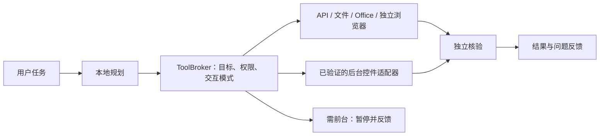

# 桌宠复用与不打扰执行方案

更新：2026-10-08。本文记录用户最新调整，优先于旧文档中固定桌宠尺寸和普通消息重复弹窗的目标描述。已实现与待接入分别列出。

## 1. 调整目标

- 桌宠大小由用户调整并保存，推荐 70%，不长期遮挡工作区。
- 主要投入转向本地规划、工具执行、核验和问题反馈，暂停连续制作新猫图片。
- 普通任务优先在后台完成，不移动鼠标、不模拟全局按键、不改变前台窗口、不覆盖用户剪贴板。
- 用户明确给出平台、已核验联系人和最终正文时，该条指令即是该次普通发送的授权，不重复弹确认框。模型起草、模糊目标、附件或敏感内容仍需核对；“帮我回复”不授权任意外发。
- 能力目标扩展为应用、文件、浏览器、办公、媒体、编程和一般系统操作。钱包、银行、付款、交易、密码、验证码和密钥不属于概括授权；永久删除、权限变更、管理员修改等较大影响动作仍须具体确认。

## 2. 桌宠大小：当前实现

| 操作 | 行为 |
| --- | --- |
| 右下角小手柄 | 拖动等比例缩放，结束时保存 |
| 鼠标放到桌宠上，Ctrl＋滚轮 | 每次改变 5%，立即保存 |
| 右键 → 桌宠大小 | 40%–160% 滑块，可恢复推荐 70% |
| 托盘 → 桌宠大小 | 常用比例快捷选择 |
| 展开任务面板 | 保留独立尺寸，不受桌宠缩放影响 |
| 显示器/DPI变化 | 保持比例，临时限制在工作区，不覆盖用户偏好 |

基准 300×372 DIP，70% 为 210×260.4 DIP；角色、状态和名字同步缩放，手柄保持可点击。大小与坐标原子保存到数据目录的 `pet-window-position.json`，不改通用设置；旧的仅含坐标记录按 100% 恢复。首次启动和托盘显示桌宠不主动激活窗口；点击任务面板或明确切换窗口才进入前台。

当前仍使用 v15 静态三维渲染 PNG，未实现实时网格或动画。

## 3. 开源复用决策

首选评估 [VPet](https://github.com/LorisYounger/VPet)：官方提供可嵌入 WPF 的 Core/NuGet，有动画和扩展机制。[Core 工程](https://github.com/LorisYounger/VPet/blob/c3420bb77d6d00ed5fabf975a0945c4f6179bba3/VPet-Simulator.Core/VPet-Simulator.Core.csproj)使用 .NET 8/WPF，依赖 LinePutScript、Panuon、SkiaSharp。源码[许可证](https://github.com/LorisYounger/VPet/blob/c3420bb77d6d00ed5fabf975a0945c4f6179bba3/LICENSE)为 Apache-2.0；正式引入前登记传递依赖、NOTICE 和角色素材许可。2026-10-08 记录上游 commit `c3420bb77d6d00ed5fabf975a0945c4f6179bba3`，[NuGet 页面](https://www.nuget.org/packages/VPet-Simulator.Core/1.1.0.66)显示 `1.1.0.66`；包与源码不假定一一对应。

保留 WPF Host、托盘和任务面板，通过 `PetRenderer` 适配层替换宠物控件。复用动画调度与交互；渲染层只接受状态、尺寸和动作事件，不获得工具、聊天、网络或执行权限。不引入整套游戏数值、云聊天或代码插件。VPet 不会将单张猫 PNG 自动变成三维猫；猫的动画素材需要另行准备。

**隔离兼容性核验（2026-10-08）：** 固定上游源码 commit `c3420bb77d6d00ed5fabf975a0945c4f6179bba3` 的 Windows WPF 工程已采用 .NET 10；稳定 NuGet `VPet-Simulator.Core 1.1.0.66` 针对 .NET 8，包页声明可由更高版本引用。使用锁定的 .NET SDK 10.0.401，在仓库忽略目录 `.tools\VPetCoreProbe` 建立隔离 WPF 类库，目标与 Host 相同的 `net10.0-windows10.0.26100.0`；编译了 `Main(GameCore)` 创建和 `Dispose()` 调用，Release 构建0警告、0错误。NuGet 全部传递依赖漏洞检查未发现易受攻击包。包 SHA-256：`CC40B86A1F45AE949781E6334EBEE6E678FB43E0CFD40CF54A6212B064A2DBCE`。

该次解析得到 LinePutScript 1.11.9、LinePutScript.Localization.WPF 1.0.7、Panuon.WPF 1.1.3、Panuon.WPF.UI 1.2.4.10、SkiaSharp 与 SkiaSharp.NativeAssets.Win32 3.116.1。Core 包含 Apache-2.0 许可证文件；依赖元数据分别标明 Apache-2.0 或 MIT；核心与LinePutScript包内附许可证文件。项目级 NuGet 源映射保持不变，只有忽略目录中的探针 NuGet.Config 列出所需精确包 ID。稳定版优先于页面显示的预发布版 `1.1.0.67-a`。

**隔离 WPF 运行探针（2026-10-08）：** 新增 `tools/XiaoK.PetRuntimePrototype` 并纳入解决方案/CI，精确锁定 `VPet-Simulator.Core 1.1.0.66` 及传递依赖。探针创建`GameCore`、`GraphCore`、`GameSave`和最小`IController`，使用`Main.LoadALL()`，只注册小K自制 v15 PNG 作为循环`Default`图。独立窗口为320×320 DIP，截图中猫图控件约300×300 DIP；窗口显示15秒后自动关闭。前台 HWND 在显示前、显示中和关闭后保持一致，关闭时 VPet 控件与图形核心完成释放。探针没有连接 ToolBroker、推理、聊天、托盘或正式Host，也没有启动麦克风/通知/模型。它证明已发布 NuGet Core 可以在本机加载并显示自制图像，但单帧循环不是多帧动画，截图透明区为黑色，因此不作为实际桌面透明合成证据。正式 Host 未引用此 NuGet。

探针发现稳定 NuGet 包与记录的源码快照 API 并非完全相同：锁定包的`GraphCore`构造器为两个参数，图形配置需随后赋值；实现以包 DLL 反射确认的 API 和精确 NuGet 锁文件为准，不把上游源码示例直接当作包 API。探针必须经仓库内`.tools\dotnet\dotnet.exe`启动；直接双击默认 apphost 会因系统只装有.NET 7而弹出缺少.NET 10运行时提示。上游默认动画归 VUP-Simulator 团队所有且另有署名/使用条件；小K使用自制素材，不捆绑默认角色素材。

**决定：** 运行探针完成了渲染可行性验证，仍保留小K自己的正式 WPF 窗口/托盘/缩放与权限边界。后续先补自制多帧动画，再在独立适配层核验真实透明合成、40%–160%缩放与DPI/睡眠恢复、CPU/RAM/显存和包体；这些门槛通过前，不把VPet加入正式Host。本阶段没有改变产品运行依赖，桌宠动画仍不阻塞后台工具开发。

## 4. 后台执行架构

| 路径 | 场景 | 不打扰条件 |
| --- | --- | --- |
| API、文件服务、固定命令适配器 | 文件、文档、媒体、构建、应用接口 | 受限目标；不访问交互桌面；写入可恢复；不用剪贴板 |
| 独立浏览器配置 | 搜索、网页读取、表单准备 | 单独标签/配置，不接管当前页面；外发仍检查授权 |
| 后台控件接口 | 应用支持的 Value/Invoke 等模式 | 逐客户端版本实测；不得导致焦点变化或误投 |
| 前台界面操作 | 无后台接口的自绘应用、仅坐标操作 | 默认不执行；反馈需前台，用户同意专用会话或暂停工作后再执行 |

[Microsoft UI Automation 说明](https://learn.microsoft.com/en-us/dotnet/framework/ui-automation/using-ui-automation-for-automated-testing)指出程序化访问依赖应用提供的控件模式；[Power Automate 桌面自动化说明](https://learn.microsoft.com/en-us/power-automate/desktop-flows/desktop-automation)明确其 UI 动作会要求或拉到前台。不能承诺任意应用都可无干扰后台执行。Windows 虚拟桌面仍共享输入，不是独立鼠标/键盘会话；虚拟机或独立会话也不自动继承当前微信/QQ登录。

### 已实现的后台准入

`ToolInteractionPolicy` 用固定工具表，模型不能通过参数改变模式。`ToolBroker.ExecuteBackgroundAsync` 执行前拒绝需前台的工具，返回 `FOREGROUND_REQUIRED`；未知工具和非法上下文返回 `UNKNOWN_TOOL`、`INVALID_EXECUTION_CONTEXT`。通知分析队列已接此入口。

- 后台：文件搜索、只读代码说明、隔离编程任务、消息分析、通知分析、草稿生成、消息发送预览。审批与代码审阅通过非模态待办中心显示，不要求任务路由切换前台。
- 当前需用户交互：应用启动、窗口切换；这两项会改变用户当前桌面状态。
- 兼容入口 `ExecuteAsync(proposal, token)` 仅供直接用户交互，保留既有行为；新增后台步骤必须使用后台入口。
- 任务状态恢复会把上次进程遗留的 `AwaitingApproval` 映射为 `OutcomeUncertain` / `APPROVAL_NOT_RESTORED`；隔离代码任务的旧 `awaiting_approval` 也显示为中断待核对，避免显示失效待办。待审批内容仍只在内存，关闭或重启后不会恢复批准按钮、继续执行或重放。
- 已有内存非模态审批待办，但没有持久空闲任务队列或跨进程审批恢复；重启后旧审批显示为待核对。Office/浏览器后台适配器和后台发送也未完成。未实现的路径应拒绝并反馈，不声称已排队或完成。

后续加入 `InteractionCoordinator` 和 `WaitingForUserIdle` 状态，由可信 Host 发放短时前台租约，模型不能自行获取；用户输入时停止下一步，取消即释放。恢复光标位置不能作为不打扰证明，禁止先抢焦点再恢复来伪装后台操作。

## 5. 微信与 QQ 直接发送

当前只有只读预览，无真实适配器。仍只验证 QQ `K`、微信 `L`；显示名不唯一，不能凭截图发送。

接入顺序：核对客户端版本/控件能力 → K/L绑定稳定身份 → 独立核对联系人/会话 → 选择已实测不影响前台的路径 → 核验发送结果。没有接口、离线、找不到人、重名、身份过期时反馈，不切窗口搜索、不向近似名称发送、不自动重发。不读客户端数据库、不注入进程、不逆向消息协议。

目标协议 `ExplicitSendInstruction` 由 Host 从用户原始指令生成，包含任务ID、平台、稳定联系人引用、最终正文摘要、附件身份、单次有效期和用户来源；与模型提案分离。模型、网页和通知不能生成授权；目标或正文改变使授权失效。“发送这份草稿”须绑定用户看过的版本；结果不确定转人工核对。

该授权协议、后台发送、控件验证和结果核验均未实现。本次不发送消息。

## 6. 新开发顺序与验收

1. **本阶段：** 缩放/保存、后台准入、文档同步、签名安装版更新。
2. **下一阶段：** 不抢焦点的任务/审批中心、后台能力登记与问题分类；先验证文件、只读代码检索、独立浏览器在用户持续工作时的表现。
3. **消息阶段：** K/L稳定身份和后台能力实测，再接真实发送；无可靠路径就反馈当前客户端暂不支持，不退回抢输入的坐标点击。
4. **通用能力阶段：** 文档/表格、媒体、应用设置、受限文件编辑、编程分批增加；每个适配器含权限、取消、核验、回滚和正常/失败样例。
5. **宠物动画阶段：** VPet 原型复用动画，保持缩放/隐藏与资源预算，不连续换图片。

验收覆盖 40%/70%/100%/160%、拖动/滚轮/滑块、重启保存、DPI/工作区、展开收起；后台任务运行时用户在另一应用打字，前台、光标、剪贴板不变，无误投；失败/取消能反馈；找不到人、重名、账号切换、客户端退出和结果不确定均不误发。资金/凭证拒绝概括授权。原 P0/P4 模型、通知30条/客户端、资源和六场景发布闸门继续保留；本阶段不代表发布完成。
